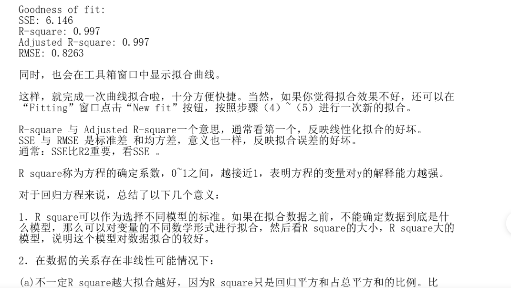

<!--  -->

## 基本使用

### 格式化输入输出：
```matlab
1. 格式化输入：
x = input('请输入x的值')

2. 格式化输出
fprintf('y的值是%f',y)

3. 非格式化输出
disp(a)  
```
### 符号变量的输入
```matlab
syms a1 a3 a4 a5 a6;  % 这里必须先声明 这些变量是符号变量而不是数值
matrix = [a1,a6,a5;a6,a1,a4;a5,a4,a3]

```

## 小技巧

调参数方法
```matlab
1.选中变量值 右键“递增值和运行节”
2.选中变量值 ctrl + 滚轮 
```

拟合
```matlab
控制台中输入
>>> cftool
```